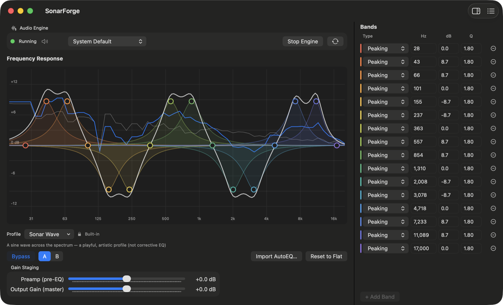

<h1 align="center">SonarForge</h1>

<p align="center">
  <strong>A free, open-source, system-wide parametric equalizer for macOS.</strong><br>
  Native SwiftUI · low CPU · artifact-free · first-class AutoEQ headphone support.
</p>

<p align="center">
  
  
  
  
</p>

<p align="center">
  
</p>

SonarForge sits in your Mac's audio path and shapes **everything you hear** — no per-app setup, no virtual devices to wrangle. It pairs a precise multi-band parametric EQ with a live spectrum analyzer and seamless [AutoEQ](https://github.com/jaakkopasanen/AutoEQ) headphone corrections, in a window that feels like it shipped with macOS.

> *Pictured: the built-in **Sonar Wave** preset — 16 bands drawn as a sine wave, each colored by where it sits in the spectrum (warm bass → cool treble).*

## Highlights

- 🎚️ **True system-wide EQ** — driverless capture via Core Audio Taps; processes all system audio at once.
- 🎧 **AutoEQ in two clicks** — paste or drop an AutoEQ profile; source attribution is preserved and shown.
- 📈 **Live spectrum + color-coded curve** — always-on pre/post FFT traces (Accelerate/vDSP) behind a draggable response curve, with each band colored by its place in the spectrum.
- 🪶 **Low CPU, artifact-free** — Direct Form II Transposed biquads; ~0.2% of one core for a full band set.
- 🗂️ **Profiles** — save, import/export, favorites, quick-switch, A/B compare, and global bypass.
- 🍎 **Native & accessible** — SwiftUI, dark mode, full keyboard + VoiceOver support, menu-bar item.
- 🆓 **Free & private** — Apache 2.0, zero telemetry, no network calls, no paywalls.

**Requirements:** macOS 14.2+ on Apple Silicon (M1 or newer). *Intel Macs are not supported.*

## Install

1. Download `SonarForge-<version>.dmg` from the [latest release](https://github.com/ethancooke/SonarForge/releases).
2. Open the disk image and **drag SonarForge to Applications**.
3. Launch from Applications. Builds are signed and notarized by Apple, so it opens with the normal one-time confirmation — no Gatekeeper workarounds.
4. Grant **System Audio Recording** when prompted (required for the Core Audio tap).
5. Play something, hit **Start Engine**, and pick or import a profile.

## Using SonarForge

- **Graph editor** — drag a band handle to set frequency (x) and gain (y); ⌥-drag for Q; double-click to add a band; right-click to delete.
- **Band list** — precise numeric editing of type / Hz / dB / Q.
- **Profiles** — switch from the Profile menu; manage, import, and export from the Profiles button. Drop a profile or AutoEQ file anywhere on the window to import it.
- **Compare** — toggle **A | B** between two profiles, or **Bypass** to hear the original.
- **Shortcuts** — press ⌘? for the in-app cheat sheet.

## AutoEQ headphone corrections

SonarForge makes community headphone corrections from [AutoEQ](https://github.com/jaakkopasanen/AutoEQ) painless:

1. Find your headphone's Parametric EQ settings (AutoEQ / oratory1990).
2. Copy the text block.
3. **Profiles → Import from AutoEQ** — or just drop the file on the window.
4. The profile is created with full source attribution, shown in the app.

> Imported profiles always retain credit to the original measurement author and AutoEQ.

## Building from source

Requires Xcode 16+ and an Apple Silicon Mac (macOS 14.2 deployment target).

```bash
git clone https://github.com/ethancooke/SonarForge.git
cd SonarForge
open SonarForge.xcodeproj   # build the SonarForge scheme
```

Distribution builds come from `Scripts/release.sh` (sign → notarize → staple → dmg/zip). See [Documentation/SIGNING.md](Documentation/SIGNING.md).

## Under the hood

- **Capture:** Core Audio Taps (`CATapDescription`, `AudioHardwareCreateProcessTap`) — modern, driverless, low overhead.
- **DSP:** RBJ biquads in Direct Form II Transposed, with lock-free parameter updates to the realtime thread.
- **Analysis:** Accelerate `vDSP` FFT with windowing and log-frequency mapping.
- **Local-only:** no network calls, ever. Handles sample-rate and device changes gracefully (44.1–96 kHz+).

More depth in [Documentation/AUDIO_PATH.md](Documentation/AUDIO_PATH.md).

## Non-goals

AU/plugin hosting · spatial/3D audio · per-app routing · convolution/FIR · any monetization.

## Contributing

Contributions that improve audio quality, stability, or native feel are welcome — see [CONTRIBUTING.md](CONTRIBUTING.md). High-value areas: DSP/coefficient quality, realtime performance, SwiftUI polish & accessibility, and AutoEQ import robustness.

## Thanks

- [eqMac](https://github.com/bitgapp/eqMac) (Apache 2.0) — prior art for system-wide EQ on macOS.
- Apple's Core Audio team and public sample code for Audio Taps.
- The AutoEQ community and headphone measurement experts (oratory1990 et al.).

## Disclaimer & privacy

Provided **"AS IS"**, with no warranty and no liability for damages (Apache 2.0 §7–8). An equalizer can make audio **much louder** — large boosts or a high preamp can overdrive headphones and speakers, so start quiet and protect your hearing.

SonarForge is an independent project and is **not affiliated with or endorsed by** Apple, Bitgap (eqMac), or the AutoEQ project; their names refer only to them. It bundles no AutoEQ data — it parses files you supply. The app collects nothing (see [PRIVACY.md](PRIVACY.md)); third-party notices live in [NOTICE](NOTICE).

## License

[Apache License 2.0](LICENSE).

---

<p align="center"><strong>SonarForge</strong> — Precise. Native. Free.</p>

<sub>New contributor or AI agent? Start with [AGENTS.md](AGENTS.md) for the recommended reading order (VISION, DECISIONS, STATE, …).</sub>
